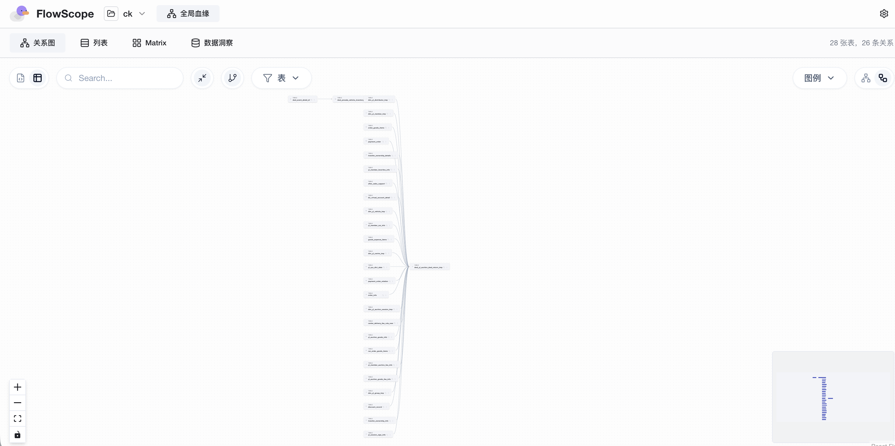
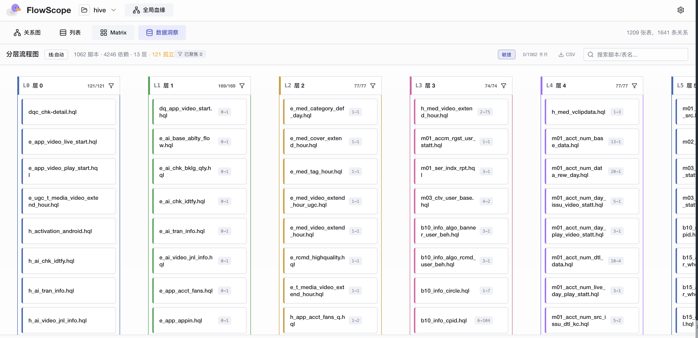
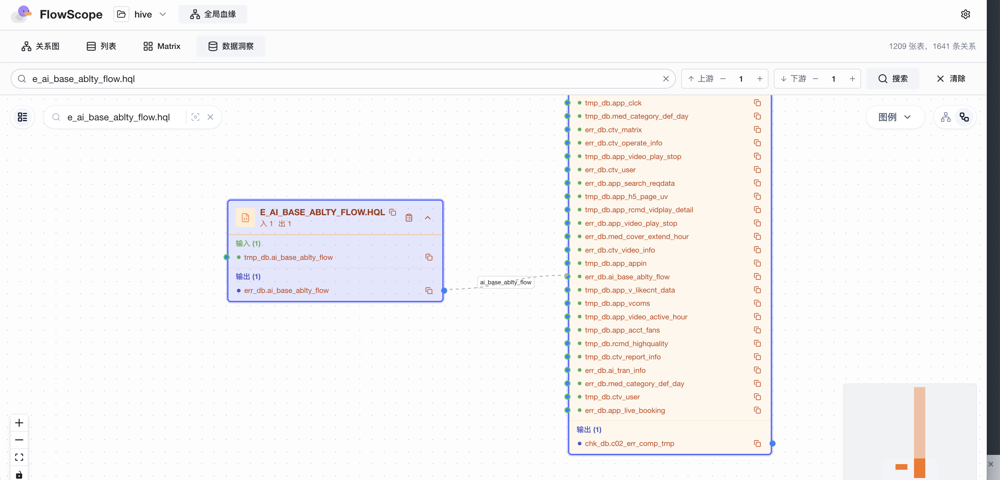
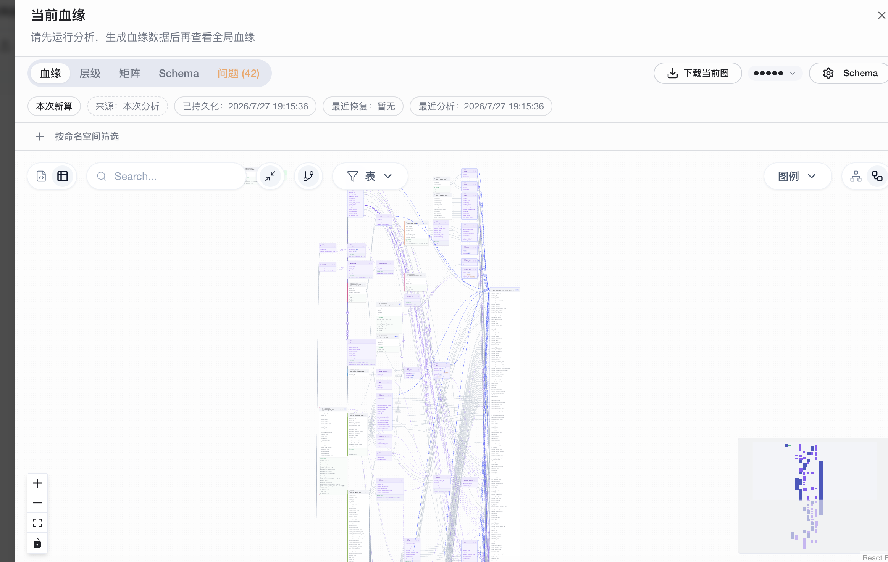
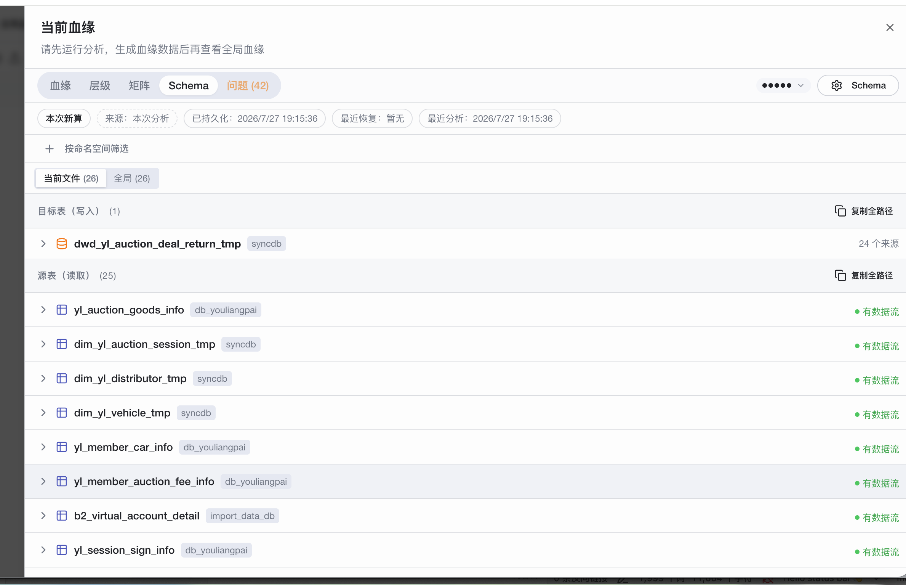

# FlowScope — SQL 血缘分析平台

> 拖入 SQL 文件，秒出血缘关系图。隐私优先，全程浏览器/WASM，SQL 不上传服务器。

---

## ✨ 核心功能

### 1. 全局血缘关系图

直观展示表与表之间的数据流向，支持缩放、拖拽、搜索定位。



- 28 张表、26 条关系一目了然
- 点击节点查看上下游链路
- 支持表级 + 列级血缘

---

### 2. 分层流程图（矩阵视图）

1000+ 脚本自动拓扑分层，从左到右展示完整数据 pipeline。



- **L0** = 孤立脚本 | **L1~LN-1** = 中间 pipeline | **LN** = 结果脚本
- **敏捷模式**：点选脚本 → 只显示其上下游链
- **全览模式**：所有卡片保留，高亮选中链
- 按层筛选、全局搜索、CSV 导出
- 悬停查看影响范围（↑上游数 ↓下游数 · 影响表数）

---

### 3. 数据洞察

表级血缘穿透 CTE，精确展示每个脚本的读写关系。



- 搜索任意脚本/表名 → 展开上下游
- 点击表行 → 方向高亮（读→上游写者，写→下游读者）
- 独立 store，不影响关系图状态

---

### 4. 单脚本血缘图

打开单个 SQL 文件，即时渲染列级血缘。



- 表展开 → 列级连线
- 高亮选中列的传播路径
- 支持 CTE 穿透

---

### 5. Schema 管理

解析后的表结构自动归档，支持持久化和恢复。



- 当前文件表 + 全局表分类展示
- 来源标记（本次新算 / 已持久化 / 来源推断）
- Schema 问题检测（42 条 issue）

---

## 🔒 隐私优先

所有 SQL 分析在浏览器 WebAssembly 中完成，**SQL 内容不上传任何服务器**。

Serve 模式下，分析在本地 Rust 引擎运行，数据不外发。

---

## 🚀 快速开始

### 在线体验

**[flowscope.pondpilot.io](https://flowscope.pondpilot.io)** — 拖拽 SQL 文件即可，无需注册。

### CLI

```bash
cargo install flowscope-cli

# 分析单个文件
flowscope query.sql

# 分析整个目录
flowscope -d hive etl/*.sql

# 导出 Mermaid 血缘图
flowscope -f mermaid -v column query.sql > lineage.mmd

# Lint + 自动修复
flowscope --lint --fix queries/*.sql
```

### Serve 模式（本地服务器 + Web UI + REST API）

```bash
flowscope --serve --watch ./sql --open
```

- Web UI: `http://localhost:3000`
- REST API: 44+ 端点
- OpenAPI 文档: `http://localhost:3000/api/docs`

### NPM

```bash
npm install @pondpilot/flowscope-core @pondpilot/flowscope-react
```

```typescript
import { initWasm, analyzeSql } from '@pondpilot/flowscope-core';

await initWasm();
const result = await analyzeSql({
  sql: 'SELECT * FROM analytics.orders',
  dialect: 'postgres',
});
```

---

## 📊 数据规模

| 指标 | 实测 |
|------|------|
| 脚本数 | 1083+ |
| 依赖关系 | 9511+ |
| 自动分层 | 38 层 |
| WASM 解析速度 | 毫秒级 |
| 隐私 | 全程本地 |

---

## 🛠 技术栈

| 层 | 技术 |
|----|------|
| 核心引擎 | Rust + sqlparser |
| 浏览器层 | WebAssembly |
| 前端 | React + TypeScript + Vite |
| 图渲染 | React Flow (关系图) + SVG (矩阵) |
| 存储 | SQLite-WASM / 服务端 SQLite |
| 扩展 | VS Code Extension |

---

## 📦 项目结构

```
flowscope/
├── crates/                  Rust 引擎
│   ├── flowscope-core/      核心血缘引擎
│   ├── flowscope-wasm/      WASM 绑定
│   ├── flowscope-cli/       CLI + Serve 模式
│   └── flowscope-export/    导出（Mermaid/HTML/CSV/XLSX/DuckDB）
├── packages/                NPM 包
│   ├── core/                @pondpilot/flowscope-core
│   └── react/               @pondpilot/flowscope-react
├── app/                     Web 应用
├── vscode/                  VS Code 扩展
└── docs/                    文档
```

---

## 🌍 支持的方言

PostgreSQL · Snowflake · BigQuery · DuckDB · Redshift · Hive · MySQL · SQLite · ...

内置 dbt / Jinja 宏支持（`ref()`, `source()`, `var()`）。

---

## 📝 License

- 核心引擎: [Apache-2.0](../LICENSE)
- Web 应用: O'Saasy License

---

**Part of the [PondPilot](https://github.com/keaidada/flowscope) project.**
